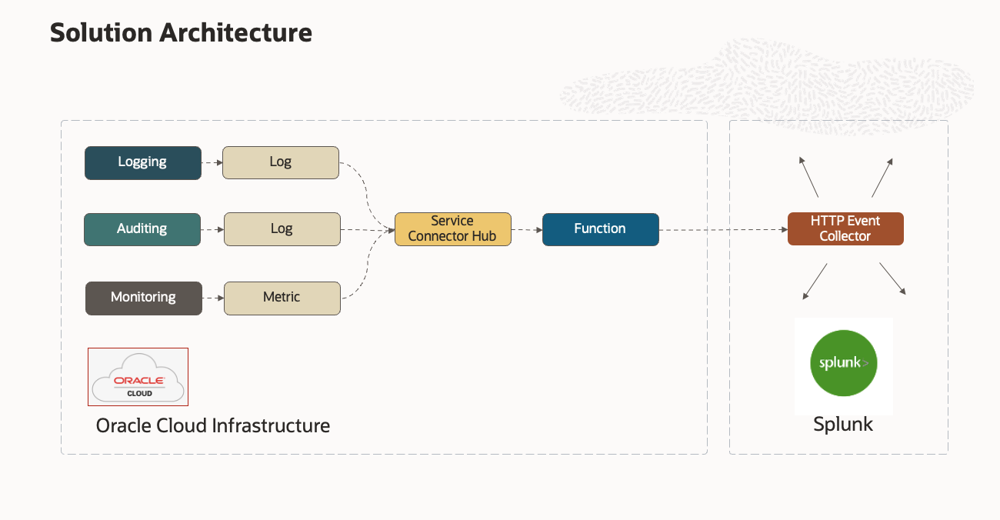

# Exporting OCI Logs and Metrics to Splunk

---

## Overview

Let's take a look at bringing Oracle Cloud Infrastructure (OCI)’s rich Metrics resources over to 
[Splunk](https://splunk.com) to accomplish common goals such DevOps monitoring, application performance monitoring, and so on. 

### Prerequisites

If you’re new to Functions, get familiar by running through 
the [Quick Start guide on OCI Functions](http://docs.oracle.com/en-us/iaas/Content/Functions/Tasks/functionsquickstartguidestop.htm) before proceeding.

---
## Solution Architecture

Here is the basic architecture:

* OCI Services emit metric and logging data which is captured by the Monitoring and Logging services respectively.
* Both Monitoring and Logging services can feed their data to a Service Connector for downstream processing.
* The Service Connector can pass those data feeds to a Function.
* Functions can transform the events into Splunk format and post to Splunk HTTP Event Collector REST API.

Let's drill down into the OCI Services involved.

---
## Monitoring Service

 The [Monitoring Service](https://docs.oracle.com/en-us/iaas/Content/Monitoring/Concepts/monitoringoverview.htm)
 receives timestamp-value pairs (aka metric data points) which also carry contextual 
dimensions and metadata about the services or applications that emitted them. 

---
## Logging Service

 The [Logging Service](https://docs.oracle.com/en-us/iaas/Content/Logging/Concepts/loggingoverview.htm)
is a highly scalable and fully managed single pane of glass for all the logs in your tenancy. Logging provides 
 access to logs from Oracle Cloud Infrastructure resources. These logs include critical 
 diagnostic information that describes how resources are performing and being accessed.

---
## Service Connector Hub

The stream of Metric data is event-driven and must be handled on-demand and at scale. The 
[Service Connector Hub](https://docs.oracle.com/en-us/iaas/Content/service-connector-hub/overview.htm) does
exactly that.  See [Service Connector Hub documentation](https://docs.oracle.com/en-us/iaas/Content/service-connector-hub/overview.htm) for details.

---
## Functions Service

I need to transform between the raw metrics formats and some way to make the Splunk API calls. The 
[OCI Functions Service](http://docs.oracle.com/en-us/iaas/Content/Functions/Concepts/functionsoverview.htm) is a 
natural fit for the task. Functions integrate nicely with Service Connector Hub as as a target and can scale up
depending on the demand.  That lets me focus on writing the logic needed without needing to address how to 
deploy and scale it.

---
## Mapping From OCI to Splunk Formats

A key requirement of course is the mapping of OCI to Splunk format.  Let's compare the OCI and Splunk
message payload formats, what the mapping needs to accomplish, and see what the resulting transformed message 
looks like.

### Example OCI Metrics Payload:
    
    {
        "namespace": "oci_vcn",
        "resourceGroup": null,
        "compartmentId": "ocid1.compartment.oc1...",
        "name": "VnicFromNetworkBytes",
        "dimensions": {
            "resourceId": "ocid1.vnic.oc1.phx..."
        },
        "metadata": {
            "displayName": "Bytes from Network",
            "unit": "bytes"
        },
        "datapoints": [
            {
                "timestamp": 1652196912000,
                "value": 5780.0,
                "count": 1
            }
        ]
    }

### Example OCI Logging Payload:

    {
      "datetime": 1689108090000,
      "logContent": {
        "data": {
          "action": "ACCEPT",
          "bytesOut": 4132,
          "destinationAddress": "147.154.1.1",
          "destinationPort": 443,
          "endTime": 1689108091,
          "flowid": "75d72a74",
          "packets": 9,
          "protocol": 6,
          "protocolName": "TCP",
          "sourceAddress": "10.0.0.1",
          "sourcePort": 60830,
          "startTime": 1689108090,
          "targetSystem": "SPLUNK",
          "status": "OK",
          "version": "2"
        },
        "id": "159f15e5",
        "oracle": {
          "compartmentid": "ocid1.compartment.oc1...",
          "ingestedtime": "2023-07-11T20:42:24.573Z",
          "loggroupid": "ocid1.loggroup.oc1.phx...",
          "logid": "ocid1.log.oc1.phx...",
          "tenantid": "ocid1.tenancy.oc1...",
          "vniccompartmentocid": "ocid1.compartment.oc1...",
          "vnicocid": "ocid1.vnic.oc1.phx...",
          "vnicsubnetocid": "ocid1.subnet.oc1.phx..."
        },
        "source": "-",
        "specversion": "1.0",
        "time": "2023-07-11T20:41:30.000Z",
        "type": "com.oraclecloud.vcn.flowlogs.DataEvent"
      }
    },

### Splunk Supported Formats

There are several formats supported by Splunk,
See [Format events for HTTP Event Collector](https://docs.splunk.com/Documentation/Splunk/latest/Data/FormateventsforHTTPEventCollector)
To get a sense of the options.

### Default Mapping Behavior

By default, the Function will transform OCI events as needed to instruct the Splunk platform to extract JSON 
fields from the events you send to HEC.  See [Example 8](https://docs.splunk.com/Documentation/Splunk/9.1.0/Data/HECExamples#Example_9:_Explicit_JSON_fields).

    {
         "sourcetype": "_json", 
         "event": {
             <single OCI event record goes here in its entirety>
         }
    }

### [Optional] Fine-Grained Control over Mapping Behavior

You can alternatively configure the Function to map JSON more precisely to fit your needs.
The Payload Map feature (if enabled) lets you select the keys ` or l-values` you want to pass to Splunk.
The assigned values or `r-values` will come from the OCI event records.
The mapper looks for a `"name" l-value` key in the OCI record.   If it finds this key anywhere in the record, 
it will output the` l-value or value` corresponding to that key as the value for `"name"` in the resulting JSON.

You can customize the Fine-Grained mapper by simply create a JSON modeled on the below default and 
install it as a Function Application configuration parameter.

To enable this feature:
* set `USE_PAYLOAD_MAP` = `True`. 

To customize it:
* set `CUSTOM_PAYLOAD_MAP` = custom payload map (JSON) you want to use.

Here is the default the Fine-Grained mapper JSON:

     {
         "fields": {
             "name": "name",
             "namespace": "namespace",
             "timestamp": "timestamp",
             "value": "value",
             "count": "count",
             "type": "type",
             "source": "source",
             "displayName": "displayName",
             "compartmentid": "compartmentid",
             "ingestedtime": "ingestedtime",
             "sourceAddress": "sourceAddress",
             "destinationAddress": "destinationAddress",
             "tenantid": "tenantid"
         }
     }

Resulting Output of a Log Event using the Fine-Grained mapper:

    {
        "fields": {
            "type": "com.oraclecloud.vcn.flowlogs.DataEvent",
            "source": "-",
            "compartmentid": "ocid1.compartment.oc1...",
            "ingestedtime": "2023-07-11T20:44:06.225Z",
            "sourceAddress": "129.146.14.168",
            "destinationAddress": "10.0.0.219",
            "tenantid": "ocid1.tenancy.oc1..."
        }
    }

Resulting Output of a Metric Event using the Fine-Grained mapper:

    {
        "fields": {
            "name": "VnicFromNetworkMirrorBytes",
            "namespace": "oci_vcn",
            "timestamp": 1652196492000,
            "value": 0.0,
            "count": 1,
            "displayName": "Mirrored Bytes from Network"
        }
    }

---
# OCI

Here are the steps to set up OCI.

## Compartment

Create a compartment to contain the following:

- Virtual Cloud Network
- Application + Function
- Service Connector

_Let's assume you create a compartment with name `ABC`._

## Group

Create a user group where we can assign developer related policies.   

_Let's assume you create a user group with name `functions-developers`._

## Policies

See [common policies](https://docs.oracle.com/en-us/iaas/Content/Identity/Concepts/commonpolicies.htm).

Let's assume we will permit users in 'functions-developers' to create, deploy and manage Functions and Applications.

    Allow group functions-developers to manage repos in tenancy
    Allow group functions-developers to manage serviceconnectors in tenancy
    Allow group functions-developers to manage metrics in tenancy
    Allow group functions-developers to manage logging in tenancy
    Allow group functions-developers to use cloud-shell in tenancy
    Allow group functions-developers to use virtual-network-family in tenancy

We need to allow Functions Service to use OCIR Repositories:

    Allow service faas to use repos in tenancy 

We need to allow Service Connector to use Functions and Metrics and Logs:

    Allow service service-connector-hub to use functions-family in compartment ABC
    Allow service service-connector-hub to use metrics in compartment ABC
    Allow service service-connector-hub to use logging in compartment ABC

---
## Build the Function

Follow the steps found in the [Quick Start guide on OCI Functions](http://docs.oracle.com/en-us/iaas/Content/Functions/Tasks/functionsquickstartguidestop.htm).
The [Cloud Shell instructions](https://docs.oracle.com/en-us/iaas/Content/Functions/Tasks/functionsquickstartcloudshell.htm#functionsquickstart_cloudshell) are recommended.
### Function Configuration

Once you have your Function Application build, configure the Function by setting up the following Configuration:

| Environment Variable        |    Default     | Purpose                                                                                                                                                                   |
| ------------- |:--------------:|:--------------------------------------------------------------------------------------------------------------------------------------------------------------------------|
| SPLUNK_HEC_ENDPOINT      | not-configured | REST API endpoint for reaching Splunk HTTP Event Collector.  SPLUNK_HEC_ENDPOINT trial account example:  https://{your-subdomain}.splunkcloud.com:8088/services/collector |
| SPLUNK_HEC_TOKEN      | not-configured | API token token obtained from Splunk                                                                                                                                      |
| SEND_TO_SPLUNK |      True      | Determines whether messages are forwarded to Splunk                                                                                                                       |
| VERIFY_SSL |      True      | This should be enabled in production                                                                                                                                      |
| LOGGING_LEVEL |      INFO      | Controls function logging outputs.  Choices: INFO, WARN, CRITICAL, ERROR, DEBUG                                                                                           |
| BATCH_SIZE |      100       | Number of records posted to Splunk per call                                                                                                                               |
| USE_PAYLOAD_MAP |     False      | If False, send entire record to Splunk                                                                                                                                    |
| CUSTOM_PAYLOAD_MAP |            | Stringified JSON that is your custom mapper.                                                                                                                              |

---
## Service Connector Setup

Now let’s set up a simple service connector instance that takes Monitoring sources and passes them to our Function.

Because your Function requires a VCN, you can use that VCN as the metric source to test against.  Let's test
with the `oci_vcn` Monitoring namespace because it will quickly generate a lot of useful events.

Select Monitoring as the source and the Function as the target. Configure your source as the 
compartment where the VCN resides and select the Monitoring namespace (`oci_vcn`) that you want to
pick up. Select your Application and the Function within it as the target.

---
## Troubleshooting

[Enable Function Invocation Service logs](https://docs.oracle.com/en-us/iaas/Content/Functions/Tasks/functionsexportingfunctionlogfiles.htm) to see the logs generated by the Function.
Set `LOGGING_LEVEL = DEBUG` as a general rule while first deploying the Function.  

This [troubleshooting guide](https://docs.public.oneportal.content.oci.oraclecloud.com/en-us/iaas/Content/Functions/Tasks/functionstroubleshooting.htm) can also be very helpful.

### Function Timing-Out

* Increase `BATCH_SIZE` above
* [Increase Function timeout and/or memory allocation](https://docs.oracle.com/en-us/iaas/Content/Functions/Tasks/functionscustomizing.htm)

---
## View Metrics In Splunk

When you have the Service Connector configured, metrics should appear in Splunk
after a few minutes.

---
## Conclusion

You now have a low-maintenance, serverless function that can send raw metrics over to Splunk in
near-real time. I encourage you to experiment with the payload mappings to get the most value out 
of this integration.

For more information, see the following resources:

* https://docs.splunk.com/Documentation/Splunk/latest/Data/UsetheHTTPEventCollector
* https://docs.splunk.com/Documentation/Splunk/latest/Data/HECExamples

---
## **OCI** Related Workshops

LiveLabs is the place to explore Oracle's products and services using workshops designed to 
enhance your experience building and deploying applications on the Cloud and On-Premises.
ur library of workshops cover everything from how to provision the world's first autonomous 
database to setting up a webserver on our world class OCI Generation 2 infrastructure, 
machine learning and much more.  Use your existing Oracle Cloud account, 
a [Free Tier](https://www.oracle.com/cloud/free/) account or a LiveLabs Cloud Account to build, test, 
and deploy applications on Oracle's Cloud.

Visit [LiveLabs](http://bit.ly/golivelabs) now to get started.  Workshops are added weekly, please visit frequently for new content.

---
## License
Copyright (c) 2023, Oracle and/or its affiliates. All rights reserved.
Licensed under the Universal Permissive License v 1.0 as shown at https://oss.oracle.com/licenses/upl.
