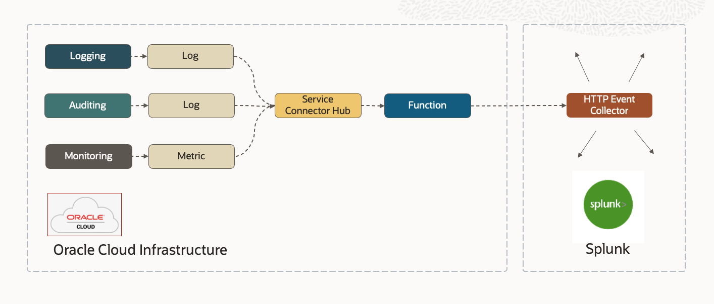

# Exporting OCI Logs and Metrics to Splunk

---

## Overview

This code sample demonstrates how to natively export Oracle Cloud Infrastructure (OCI) Observability data over to 
[Splunk](https://splunk.com) via an HTTP Event Collector.

### Prerequisites

If you’re new to Functions, get familiar by running through 
the [Quick Start guide on OCI Functions](http://docs.oracle.com/en-us/iaas/Content/Functions/Tasks/functionsquickstartguidestop.htm) before proceeding.

---
## Solution Architecture

Here is the basic flow-of-control:

* All OCI Services emit audit, metric and logging events which are ingested by the Monitoring and Logging services respectively.
* The Service Connector receives these events, invoking a Function to handle them as they arrive.
* The Function transforms the events into Splunk format and post to Splunk.

See [Splunk HTTP Event Collector REST API](https://docs.splunk.com/Documentation/Splunk/9.1.0/Data/UsetheHTTPEventCollector) to get a sense of how Splunk HEC works.

Let's drill down into the OCI Services involved.

---
## Logging Service

The [Logging Service](https://docs.oracle.com/en-us/iaas/Content/Logging/Concepts/loggingoverview.htm)
is a highly scalable and fully managed single pane of glass for all the logs in your tenancy. Logging provides 
access to log data from Oracle Cloud Infrastructure resources. These logs include critical 
diagnostic information that describes how resources are performing and being accessed.

---
## Monitoring Service

The [Monitoring Service](https://docs.oracle.com/en-us/iaas/Content/Monitoring/Concepts/monitoringoverview.htm)
receives timestamp-value pairs (aka metric data points) which also carry contextual 
dimensions and metadata about the services or applications that emitted them. 

---
## Auditing Service

The [Auditing Service](https://docs.oracle.com/en-us/iaas/Content/Audit/home.htm)
provides visibility into activities related to your OCI resources and tenancy. 
Audit log events can be used for security audits, to track usage of and changes to Oracle Cloud 
Infrastructure resources, and to help ensure compliance with standards or regulations.

---
## Service Connector Hub

The [Service Connector Hub](https://docs.oracle.com/en-us/iaas/Content/service-connector-hub/overview.htm) is designed 
to handle Audit, Logging and Monitoring event streams on-demand and at scale.  See [Service Connector Hub documentation](https://docs.oracle.com/en-us/iaas/Content/service-connector-hub/overview.htm) for details.

---
## Functions Service

We need to deploy a small amount of logic that transforms log and raw metric events into a 
format that Splunk can accept and then sends the transformed events in batch to the 
Splunk event collection endpoint.

[OCI Functions](http://docs.oracle.com/en-us/iaas/Content/Functions/Concepts/functionsoverview.htm) is a 
natural fit for the task. OCI Functions is based on the [Fn Project](https://fnproject.io/), an open source, container 
native, serverless platform that can be run anywhere - any cloud or on-premises. Fn Project 
is easy to use, extensible, and performant.

---
## Transforming OCI Events to Splunk Format

Let's compare the OCI and Splunk
message payload formats, understand the mapping task, and see what the resulting transformed messages 
look like.

Here is an example OCI Metrics event:
    
    {
        "namespace": "oci_vcn",
        "resourceGroup": null,
        "compartmentId": "ocid1.compartment.oc1...",
        "name": "VnicFromNetworkBytes",
        "dimensions": {
            "resourceId": "ocid1.vnic.oc1.phx..."
        },
        "metadata": {
            "displayName": "Bytes from Network",
            "unit": "bytes"
        },
        "datapoints": [
            {
                "timestamp": 1652196912000,
                "value": 5780.0,
                "count": 1
            }
        ]
    }

Here is an example OCI Logging event:

    {
      "datetime": 1689108090000,
      "logContent": {
        "data": {
          "action": "ACCEPT",
          "bytesOut": 4132,
          "destinationAddress": "147.154.1.1",
          "destinationPort": 443,
          "endTime": 1689108091,
          "flowid": "75d72a74",
          "packets": 9,
          "protocol": 6,
          "protocolName": "TCP",
          "sourceAddress": "10.0.0.1",
          "sourcePort": 60830,
          "startTime": 1689108090,
          "targetSystem": "SPLUNK",
          "status": "OK",
          "version": "2"
        },
        "id": "159f15e5",
        "oracle": {
          "compartmentid": "ocid1.compartment.oc1...",
          "ingestedtime": "2023-07-11T20:42:24.573Z",
          "loggroupid": "ocid1.loggroup.oc1.phx...",
          "logid": "ocid1.log.oc1.phx...",
          "tenantid": "ocid1.tenancy.oc1...",
          "vniccompartmentocid": "ocid1.compartment.oc1...",
          "vnicocid": "ocid1.vnic.oc1.phx...",
          "vnicsubnetocid": "ocid1.subnet.oc1.phx..."
        },
        "source": "-",
        "specversion": "1.0",
        "time": "2023-07-11T20:41:30.000Z",
        "type": "com.oraclecloud.vcn.flowlogs.DataEvent"
      }
    },

## Splunk Formats

By default, the Function will transform OCI events as needed 
to instruct the Splunk platform to` Extract JSON Fields` from the events as described [here](https://docs.splunk.com/Documentation/Splunk/9.1.0/Data/HECExamples#Example_9:_Explicit_JSON_fields). 

There are several formats supported by Splunk,
See [Format events for HTTP Event Collector](https://docs.splunk.com/Documentation/Splunk/latest/Data/FormateventsforHTTPEventCollector)
to get a sense of all the options. 

Here is the `Extract JSON Fields` logic:

    {
         "sourcetype": "_json", 
         "event": {
             <single OCI event record goes here in its entirety>
         }
    }

Here is an example of a transformed metric event using this logic:
 

    {
        "sourcetype": "_json", 
        "event": {
            "namespace": "oci_vcn",
            "resourceGroup": null,
            "compartmentId": "ocid1.compartment.oc1...",
            "name": "VnicFromNetworkBytes",
            "dimensions": {
            "resourceId": "ocid1.vnic.oc1.phx..."
            },
            "metadata": {
            "displayName": "Bytes from Network",
            "unit": "bytes"
            },
            "datapoints": [
            {
                "timestamp": 1652196912000,
                "value": 5780.0,
                "count": 1
            }
            ]
        }
    }

## Payload Maps

There also is an **optional** feature called a **Payload Map**.  Use it if you need greater control over the
transformation.

In this mode, the Function uses a JSON map where the `l-values` are the keys that Splunk expects to see and the `r-values` in the map _are used 
as **keys** to look up **values** in the OCI event payload_. If the Function finds a match _anywhere_ in the 
event (included nested within the JSON), the event `value` will be assigned to the Splunk-expected `key` and 
included it in the transformed output.

Here is the default payload JSON:

     {
         "fields": {
             "name": "name",
             "namespace": "namespace",
             "timestamp": "timestamp",
             "value": "value",
             "count": "count",
             "type": "type",
             "source": "source",
             "displayName": "displayName",
             "compartmentid": "compartmentid",
             "ingestedtime": "ingestedtime",
             "sourceAddress": "sourceAddress",
             "destinationAddress": "destinationAddress",
             "tenantid": "tenantid"
         }
     }

Here is the resulting output of a Log Event using the default payload JSON:

    {
        "fields": {
            "type": "com.oraclecloud.vcn.flowlogs.DataEvent",
            "source": "-",
            "compartmentid": "ocid1.compartment.oc1...",
            "ingestedtime": "2023-07-11T20:44:06.225Z",
            "sourceAddress": "129.146.14.168",
            "destinationAddress": "10.0.0.219",
            "tenantid": "ocid1.tenancy.oc1..."
        }
    }

Here is the resulting output of a Raw Metric Event using the default payload JSON:

    {
        "fields": {
            "name": "VnicFromNetworkMirrorBytes",
            "namespace": "oci_vcn",
            "timestamp": 1652196492000,
            "value": 0.0,
            "count": 1,
            "displayName": "Mirrored Bytes from Network"
        }
    }

## Customizing the Payload Map 

To customize the behavior, create your own JSON and set it as a Function Configuration parameter 
(see Function Configuration below).

Note that the `l-values` and `r-values` in the default payload JSON above are identical.  That causes the OCI `key=value` 
pairs to be passed as-is.  If you need to pass a different key for Splunk, just change the `l-value` like so:

     {
         "fields": {
             "splunk_key_1": "name",
             "splunk_key_2": "namespace",
             "splunk_key_3": "timestamp",
             "splunk_key_4": "value",
             "splunk_key_5": "count"
         }
     }

Refer to the [Splunk HEC examples](https://docs.splunk.com/Documentation/Splunk/latest/Data/HECExamples) page as a guide.

---
# OCI

Here are the steps to set up OCI.

## Compartment

Create a compartment to contain the following:

- Virtual Cloud Network
- Application + Function
- Service Connector

_Let's assume you create a compartment with name `ABC`._

## Group

Create a user group where we can assign developer related policies.   

_Let's assume you create a user group with name `functions-developers`._

## Policies

See [common policies](https://docs.oracle.com/en-us/iaas/Content/Identity/Concepts/commonpolicies.htm).

Let's assume we will permit users in 'functions-developers' to create, deploy and manage Functions and Applications.

    Allow group functions-developers to manage repos in tenancy
    Allow group functions-developers to manage serviceconnectors in tenancy
    Allow group functions-developers to manage metrics in tenancy
    Allow group functions-developers to manage logging in tenancy
    Allow group functions-developers to use cloud-shell in tenancy
    Allow group functions-developers to use virtual-network-family in tenancy

We need to allow Functions Service to use OCIR Repositories:

    Allow service faas to use repos in tenancy 

We need to allow Service Connector to use Functions and Metrics and Logs:

    Allow service service-connector-hub to use functions-family in compartment ABC
    Allow service service-connector-hub to use metrics in compartment ABC
    Allow service service-connector-hub to use logging in compartment ABC

---
## Build the Function

Follow the steps found in the [Quick Start guide on OCI Functions](http://docs.oracle.com/en-us/iaas/Content/Functions/Tasks/functionsquickstartguidestop.htm).
The [Cloud Shell instructions](https://docs.oracle.com/en-us/iaas/Content/Functions/Tasks/functionsquickstartcloudshell.htm#functionsquickstart_cloudshell) are recommended.
### Function Configuration

Once you have your Function Application build, configure the Function by setting up the following Configuration:

| Environment Variable        |    Default     | Purpose                                                                                                                                                                   |
| ------------- |:--------------:|:--------------------------------------------------------------------------------------------------------------------------------------------------------------------------|
| SPLUNK_HEC_ENDPOINT      | not-configured | REST API endpoint for reaching Splunk HTTP Event Collector.  SPLUNK_HEC_ENDPOINT trial account example:  https://{your-subdomain}.splunkcloud.com:8088/services/collector |
| SPLUNK_HEC_TOKEN      | not-configured | API token token obtained from Splunk                                                                                                                                      |
| SEND_TO_SPLUNK |      True      | Determines whether messages are forwarded to Splunk                                                                                                                       |
| VERIFY_SSL |      True      | This should be enabled in production                                                                                                                                      |
| LOGGING_LEVEL |      INFO      | Controls function logging outputs.  Choices: INFO, WARN, CRITICAL, ERROR, DEBUG                                                                                           |
| BATCH_SIZE |      100       | Number of records posted to Splunk per call                                                                                                                               |
| USE_PAYLOAD_MAP |     False      | If False, send entire record to Splunk                                                                                                                                    |
| CUSTOM_PAYLOAD_MAP |            | Stringified JSON that is your custom mapper.                                                                                                                              |

---
## Service Connector Setup

Now let’s set up a simple service connector instance that takes Monitoring sources and passes them to our Function.

Because your Function requires a VCN, you can use that VCN as the metric source to test against.  Let's test
with the `oci_vcn` Monitoring namespace because it will quickly generate a lot of useful events.

Select Monitoring as the source and the Function as the target. Configure your source as the 
compartment where the VCN resides and select the Monitoring namespace (`oci_vcn`) that you want to
pick up. Select your Application and the Function within it as the target.

---
## Troubleshooting

This [troubleshooting guide](https://docs.public.oneportal.content.oci.oraclecloud.com/en-us/iaas/Content/Functions/Tasks/functionstroubleshooting.htm) can also be very helpful.
[Enable Function Invocation Service logs](https://docs.oracle.com/en-us/iaas/Content/Functions/Tasks/functionsexportingfunctionlogfiles.htm) to see the logs generated by the Function.
It's a good idea to set `LOGGING_LEVEL = DEBUG` as a general rule while first deploying the Function.  

### Function Timing-Out

* Increase `BATCH_SIZE` to a larger value
* Set `LOGGING_LEVEL = INFO`
* [Increase Function timeout and / or memory allocation](https://docs.oracle.com/en-us/iaas/Content/Functions/Tasks/functionscustomizing.htm)

---
## View Metrics In Splunk

When you have the Service Connector configured, metrics should appear in Splunk
after a few minutes.

---
## Conclusion

You now have a low-maintenance, serverless function that can send raw metrics over to Splunk in
near-real time. I encourage you to experiment with the payload mappings to get the most value out 
of this integration.

For more information, see the following resources:

* [Splunk HTTPEventCollector](https://docs.splunk.com/Documentation/Splunk/latest/Data/UsetheHTTPEventCollector)
* [HTTPEventCollector Examples](https://docs.splunk.com/Documentation/Splunk/latest/Data/HECExamples)

---
## **OCI** Related Workshops

LiveLabs is the place to explore Oracle's products and services using workshops designed to 
enhance your experience building and deploying applications on the Cloud and On-Premises.
ur library of workshops cover everything from how to provision the world's first autonomous 
database to setting up a webserver on our world class OCI Generation 2 infrastructure, 
machine learning and much more.  Use your existing Oracle Cloud account, 
a [Free Tier](https://www.oracle.com/cloud/free/) account or a LiveLabs Cloud Account to build, test, 
and deploy applications on Oracle's Cloud.

Visit [LiveLabs](http://bit.ly/golivelabs) now to get started.  Workshops are added weekly, please visit frequently for new content.

---
## License
Copyright (c) 2023, Oracle and/or its affiliates. All rights reserved.
Licensed under the Universal Permissive License v 1.0 as shown at https://oss.oracle.com/licenses/upl.
